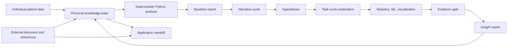

# CDHAI_June

CDHAI_June is a research-grade patient data analysis agent for continuous
glucose monitoring (CGM), behavior events, and WellDoc-style patient records.
The project is designed around one central rule: deterministic Python analysis
runs first, and language models only enter after structured data artifacts,
figures, statistical tests, and evidence ledgers exist.

The default workflow reads one patient dataset, builds a baseline data profile,
generates a literature-backed report, then repeats a configurable narrative and
probe cycle. Each cycle proposes hypotheses, creates a task-chain exploration
loop, runs allowlisted statistical and machine-learning checks, writes evidence
artifacts, gates the evidence, and only then asks the LLM to produce insight
text. The default loop runs 5 cycles and can be changed with `--cycles` or
`analysis.max_narrative_cycles` in `configs/default.yaml`.

This repository is a scaffold and research workbench. It is not a clinical
decision system, diagnostic device, or patient-facing application.

## Current Status

Implemented:

- Single-patient local file analysis for CSV, TSV, JSON, JSONL, Parquet, XLSX,
  and XLS.
- Deterministic baseline profiling, CGM metrics, event summaries, hypothesis
  testing, simple ML prediction baselines, figures, and Markdown reports.
- A bounded task-cycle loop with literature mapping, feature engineering,
  statistical packaging, neural-network baseline artifacts, visualization,
  sensitivity analysis, evidence-gap analysis, and gate decisions.
- Persistent per-patient knowledge base files under `runs/`.
- Server metadata audits for SQL-like services, SQLite assets, and WellDoc-SPACE
  manifests.
- A-User-Store composite builder that converts aligned `RecStore` records into
  `patients.parquet`, `events.parquet`, per-record Parquet files, summaries,
  and a manifest.
- CI on Ubuntu and Windows with lint, pytest, smoke pipeline, package build,
  and release artifact workflow.

Not yet fully implemented:

- A production `WellDocWorkspaceLoader` that streams governed server-side
  WellDoc cohorts directly into the runtime `PatientDataset` abstraction.
- Full large-scale training on all `AIDataStore` assets.
- Clinical validation, IRB/DUA-governed export policy automation, and
  patient-facing UI generation.
- Safe execution of arbitrary model-authored code. The current task scripts are
  reproducibility artifacts and use allowlisted local code.

## Design Framework

The project follows the design in the original CDHAI sketch:

1. Individual patient data enters a personal knowledge base.
2. Deterministic Python scripts read the data and produce a basic profile.
3. An LLM drafts a report only from structured analysis artifacts.
4. The LLM proposes hypotheses and research directions.
5. The system creates a task-chain exploration loop before insight generation.
6. Python executes statistical, ML, visualization, and evidence-gate tasks.
7. Reports and insights are persisted, so later cycles can search across earlier
   reports and find cross-report relationships.
8. Application-facing outputs are structured as messages, UI checklist items,
   and suggestions in future extensions.



The key design separation is:

- Deterministic layer: data loading, profiling, metrics, statistical tests,
  model baselines, figures, artifact writing.
- Research orchestration layer: protocols, literature matrix, hypotheses,
  task graph, evidence ledger, gate decision, cycle review.
- LLM layer: narrative drafting, hypothesis ideation, and report synthesis from
  already materialized evidence.
- Application handoff layer: future message, UI checklist, suggestion, and
  decision-support artifacts.

## Repository Structure

```text
CDHAI_June/
  configs/
    default.yaml
  docs/
    database/server_database_audit_report.md
  examples/
    sample_patient.csv
  external/
    academic-research-skills/
    codex-oauth/
    haipipe-toolkit/
    tools/
  scripts/
    build_a_user_store_composite.py
    remote_database_audit.py
    server_database_audit.py
    welldoc_space_manifest_audit.py
  specs/
    patient-analysis-agent/
  src/cdhai_june/
    analysis/
    external/
    cli.py
    config.py
    data_loader.py
    knowledge_base.py
    llm.py
    pipeline.py
    reporting.py
    research.py
    task_cycle.py
  tests/
```

Important modules:

| Module | Role |
| --- | --- |
| `data_loader.py` | Reads local patient files, normalizes column names, parses datetime columns, detects patient/time/glucose/event roles. |
| `analysis/basic.py` | Builds table profiles, missingness, column summaries, CGM/event/ML availability flags. |
| `analysis/cgm.py` | Computes CGM-focused summaries such as target-range and variability metrics when glucose columns are present. |
| `analysis/events.py` | Extracts event-like variables such as meals, carbs, exercise, steps, and medications. |
| `analysis/hypotheses.py` | Plans and executes allowlisted statistical probes. |
| `analysis/ml.py` | Produces transparent next-glucose prediction baselines. |
| `research.py` | Builds the research protocol, literature matrix, reference manifest, figure index, integrity checklist, and cycle reviews. |
| `task_cycle.py` | Runs the internal task-chain loop and writes task configs, scripts, notebooks, results, images, evidence ledgers, and gate decisions. |
| `reporting.py` | Writes baseline, cycle, and final reports through the configured LLM provider. |
| `knowledge_base.py` | Persists report summaries, hypotheses, and insights for cross-cycle retrieval. |
| `external/database.py` | Emits database/tunnel runtime hints without storing credentials. |
| `external/foundations.py` | Checks status of foundational submodules. |
| `external/haipipe_toolkit.py` | Resolves the local haipipe/WellDoc dependency status. |

## Foundational Dependencies

The project treats the repositories from the original project brief as
first-class dependencies under `external/`:

```text
external/haipipe-toolkit           -> https://github.com/JHU-CDHAI/WellDoc-SPACE.git
external/tools                     -> https://github.com/jluo41/Tools.git
external/codex-oauth               -> https://github.com/zeron-G/codex_oauth.git
external/academic-research-skills  -> https://github.com/Imbad0202/academic-research-skills.git
```

Roles:

- `haipipe-toolkit`: WellDoc/haipipe substrate for source sets, record sets,
  case sets, AI data sets, model instances, endpoint sets, and future governed
  real-data loaders.
- `tools`: search, discovery, plugin, and workflow utilities that can later feed
  verified external knowledge into cycle tasks.
- `codex-oauth`: preferred local Codex OAuth LLM transport. The `codex_oauth`
  provider uses this package when installed.
- `academic-research-skills`: research-method substrate. CDHAI_June adapts its
  literature matrix, preregistration, IMRAD, statistical reporting, review, and
  integrity-gate patterns into per-cycle patient-data reports.

`JHU-CDHAI/WellDoc-SPACE` is private, so recursive clone and editable install
require access to that organization repository.

## Data Model

The runtime data object is `PatientDataset`. It is intentionally simple:

- `patient_id`: the local patient identifier.
- `tables`: a dictionary of normalized pandas DataFrames.
- `source_path`: the input file or directory.
- `primary_table`: the largest detected table.
- `column_roles`: detected roles such as patient id, timestamp, glucose, carbs,
  meal, exercise, steps, and medication.

For WellDoc-style data, the desired canonical alignment is:

```text
patient_id      <- PatientID
internal_pid    <- PID
event_time      <- DT_s
record_time     <- DT_r, optional
timezone        <- DT_tz, optional
source_dataset
subject_id
record_type     <- CGM5Min, Diet5Min, Exercise5Min, Med5Min, HeartRate5Min, ...
value fields
```

The A-User-Store builder already uses this alignment for local zip archives.
The future `WellDocWorkspaceLoader` should use the same contract when streaming
server-side `RecStore` data.

## A-User-Store Composite Dataset

The supplied `A-User-Store.zip` follows:

```text
A-User-Store/
  UserGroup-<cohort>/
    Subject-<id>/
      1-SourceStore/
      2-RecStore/
        Record-HmPtt.CGM5Min/RecAttr.parquet
        Record-HmPtt.Diet5Min/RecAttr.parquet
        Record-HmPtt.Exercise5Min/RecAttr.parquet
        Record-HmPtt.Med5Min/RecAttr.parquet
        Record-HmPtt.Ptt/RecAttr.parquet
        Human-HmPtt/Human2RawNum.parquet
```

Build a composite local dataset:

```powershell
python scripts/build_a_user_store_composite.py `
  --zip "C:\Users\zeron\Downloads\A-User-Store.zip" `
  --output-dir reports/a_user_store_composite/latest
```

The builder:

- reads only canonical `2-RecStore` records;
- excludes `_agent_dikw_space/snapshot-*` copies to avoid duplicate historical
  agent-state records;
- writes `patients.parquet`, `human_summary.parquet`, `events.parquet`,
  per-record Parquet files, `record_summary.csv`, `subject_summary.csv`,
  `manifest.json`, and a local report;
- preserves original `PatientID` inside gitignored local artifacts because it
  is the alignment key;
- adds stable `patient_key` and `subject_key` hashes for local joins.

Recent local run summary:

| Output | Rows |
| --- | ---: |
| `patients.parquet` | 20 |
| `events.parquet` | 142,295 |
| `record_CGM5Min.parquet` | 138,802 |
| `record_Diet5Min.parquet` | 926 |
| `record_Exercise5Min.parquet` | 591 |
| `record_Med5Min.parquet` | 1,976 |

The canonical key is `PatientID + DT_s`. In the checked local output,
`event_time` has zero missing values and no snapshot rows are mixed into the
canonical event table.

## Research Loop

The deterministic analysis phase writes these artifacts before narrative
generation:

```text
analysis/
  basic_profile.json
  cgm_metrics.json
  event_metrics.json
  ml_prediction_metrics.json
  ml_next_glucose_predictions.csv
  research_protocol.json
  literature_matrix.json
  reference_manifest.json
  figure_index.json
  research_integrity_checklist.json
cycles/cycle_XX/
  hypotheses.json
  test_results.json
  task_chain/
    task_chain_summary.json
    task_graph.json
    evidence_ledger.json
    gate_decision.json
    task_001_literature_search/
      config/
      scripts/
      runs/
      results/
      images/
      notebooks/
  research_cycle_review.json
reports/
  baseline_report.md
  cycle_XX_report.md
  final_report.md
manifest.json
```

Each cycle is structured as a mini research loop:

1. Literature mapping against the verified reference manifest.
2. Hypothesis statement and falsification criterion.
3. Mechanistic reasoning stated as a hypothesis, not as fact.
4. Mathematical/statistical formulation.
5. Deterministic statistical test with sample size, p-value when available,
   and effect size.
6. ML triangulation baseline or a recorded reason that ML is not applicable.
7. Visualization artifacts.
8. Evidence-gate decision: supported, not significant, evidence gap, or ready
   for insight.

Single-patient findings are always exploratory. The system reports evidence
gaps rather than treating skipped or underpowered analyses as proof of no
relationship.

## Literature and Evidence Foundation

The embedded `reference_manifest.json` is generated by `research.py` for every
run. Reports may cite only entries in that manifest unless a future external
discovery adapter verifies and adds a new source.

Core clinical and CGM references:

| ID | Reference | Why it is used |
| --- | --- | --- |
| `battelino_2019_tir` | Battelino et al. 2019. [Clinical Targets for Continuous Glucose Monitoring Data Interpretation: Recommendations From the International Consensus on Time in Range](https://pubmed.ncbi.nlm.nih.gov/31177185/). Diabetes Care. DOI: `10.2337/dci19-0028`. | Time-in-range targets, CGM reporting metrics, target-range terminology. |
| `danne_2017_cgm_consensus` | Danne et al. 2017. [International Consensus on Use of Continuous Glucose Monitoring](https://pubmed.ncbi.nlm.nih.gov/29162583/). Diabetes Care. DOI: `10.2337/dc17-1600`. | CGM use principles, data sufficiency framing, metric interpretation. |
| `ada_2026_glycemic_goals` | American Diabetes Association Professional Practice Committee. 2026. [Glycemic Goals, Hypoglycemia, and Hyperglycemic Crises: Standards of Care in Diabetes-2026](https://pubmed.ncbi.nlm.nih.gov/41358894/). Diabetes Care. DOI: `10.2337/dc26-S006`. | Current guideline context, individualized goals caution, clinical boundary setting. |
| `rodbard_2009_cgm_interpretation` | Rodbard. 2009. [Interpretation of Continuous Glucose Monitoring Data: Glycemic Variability and Quality of Glycemic Control](https://pubmed.ncbi.nlm.nih.gov/19469679/). Diabetes Technology & Therapeutics. DOI: `10.1089/dia.2008.0132`. | Glycemic variability metrics and CGM interpretation methods. |
| `clarke_1987_error_grid` | Clarke et al. 1987. [Evaluating Clinical Accuracy of Systems for Self-Monitoring of Blood Glucose](https://pubmed.ncbi.nlm.nih.gov/3677983/). Diabetes Care. DOI: `10.2337/diacare.10.5.622`. | Clinical accuracy framing when paired reference glucose is available. |
| `parkes_2000_consensus_error_grid` | Parkes et al. 2000. [A New Consensus Error Grid to Evaluate the Clinical Significance of Inaccuracies in the Measurement of Blood Glucose](https://pubmed.ncbi.nlm.nih.gov/10937512/). Diabetes Care. DOI: `10.2337/diacare.23.8.1143`. | Future sensor accuracy and measurement-risk analyses. |

Method references that shape the roadmap:

| Area | Reference | Project use |
| --- | --- | --- |
| N-of-1 reporting | Vohra et al. 2015. [CONSORT extension for reporting N-of-1 trials (CENT) 2015 Statement](https://www.bmj.com/content/350/bmj.h1738). BMJ. | Reporting discipline for individual-level evidence loops. |
| N-of-1 explanation | Shamseer et al. 2015. [CENT 2015 explanation and elaboration](https://www.bmj.com/content/350/bmj.h1793). BMJ. | Rationale for explicit methods, limitations, and evidence grading. |
| Interpretable multi-horizon forecasting | Lim et al. 2019/2021. [Temporal Fusion Transformers for Interpretable Multi-horizon Time Series Forecasting](https://arxiv.org/abs/1912.09363). | Future deep forecasting baseline with static, known-future, and observed covariates. |
| Neural forecasting baseline | Oreshkin et al. 2019/2020. [N-BEATS: Neural basis expansion analysis for interpretable time series forecasting](https://arxiv.org/abs/1905.10437). | Future univariate glucose forecasting baseline. |
| Patch-based time-series transformer | Nie et al. 2022/2023. [A Time Series is Worth 64 Words: Long-term Forecasting with Transformers](https://arxiv.org/abs/2211.14730). | Future PatchTST-style representation learning and long-history forecasting. |
| Linear forecasting sanity check | Zeng et al. 2023. [Are Transformers Effective for Time Series Forecasting?](https://ojs.aaai.org/index.php/AAAI/article/view/26317). | Keeps simple linear baselines in the evaluation plan before heavier neural models. |

These references are not used to make clinical recommendations. They anchor
metric definitions, reporting conventions, uncertainty language, and future
model-comparison plans.

## Local Setup

```bash
git clone --recurse-submodules https://github.com/zeron-G/CDHAI_June.git
cd CDHAI_June
python -m venv .venv
.venv/Scripts/Activate.ps1
python -m pip install -e ".[dev]"
```

If you cloned without submodules:

```bash
git submodule update --init --recursive
```

Set up lighter foundations:

```powershell
scripts/setup_foundations.ps1
```

Install the heavier haipipe toolkit when running real WellDoc/haipipe loaders:

```bash
python -m pip install -e external/haipipe-toolkit
```

Or use the helper:

```powershell
scripts/setup_haipipe_toolkit.ps1
```

The default sample-data path runs without installing the heavy haipipe or Codex
OAuth dependencies. Each run manifest records whether foundational submodules
are present and whether installable packages are importable.

## Running the Pipeline

Smoke test:

```bash
python -m cdhai_june run --input examples/sample_patient.csv --patient-id demo --cycles 2 --llm-provider mock
python -m pytest
python -m ruff check src tests scripts
```

PowerShell helper:

```powershell
scripts/run_patient_analysis.ps1
```

Bash helper:

```bash
scripts/run_patient_analysis.sh
```

Generated artifacts are written under `runs/` and ignored by git.

## LLM Providers

Provider options:

- `mock`: local deterministic report drafting. This is the default for tests.
- `codex_oauth`: reads the local Codex OAuth session and calls the Codex
  responses route. It prefers `external/codex-oauth` when installed.
- `openai_compatible`: calls an OpenAI-compatible `/responses` endpoint.

Example with Codex OAuth:

```powershell
$env:CDHAI_LLM_PROVIDER = "codex_oauth"
$env:CDHAI_LLM_MODEL = "gpt-4o-mini"
python -m cdhai_june run --input examples/sample_patient.csv --patient-id demo
```

The code never logs access tokens. Keep `~/.codex/auth.json` private.

## Database and WellDoc-SPACE Access

Database credentials are not stored in this repository. Put runtime-only values
in environment variables or a local `.env` file based on `.env.example`.

Use the JHU VPN before connecting to the configured SSH host. If a tunnel is
needed, create it outside the pipeline, then point future database loaders at
the local tunnel port.

Run the aggregate remote audit:

```powershell
python scripts/remote_database_audit.py `
  --host 10.175.198.65 `
  --user rgao28 `
  --ask-password `
  --local-output-dir reports/database_audit/latest
```

Run the WellDoc-SPACE manifest audit on the server workspace root:

```bash
python3 scripts/welldoc_space_manifest_audit.py \
  --base /nvme1/group_share/WellDoc-SPACE/_WorkSpace \
  --output-json welldoc_space_manifest_summary.json \
  --output-md welldoc_space_database_report.md
```

The server audit found that accessible production data is organized primarily
as a WellDoc-SPACE workspace rather than a conventional SQL database exposed to
the current account. Important stores are:

- `1-SourceStore`: source families such as WellDoc, OhioT1DM, CGMacros,
  Dubosson, Shanghai, AIREADI, and MIMIC-IV.
- `2-RecStore`: patient-time records such as `Ptt`, `CGM5Min`, `Diet5Min`,
  `Exercise5Min`, `Med5Min`, vitals/labs, and MIMIC events.
- `3-CaseStore`: model-ready case/window definitions.
- `4-AIDataStore`: training splits for EventGlucose, FairGlucose,
  PretrainGlucose, PretrainCGM_Stride4H, OhioT1DM, and MIMIC admission tasks.
- `5-ModelInstanceStore`: model checkpoints, trainer state, result JSON, and
  figures.
- `6-EndpointStore`: deployable endpoint examples and USDA nutrition assets.

Audit artifacts are written under `reports/`, which is ignored by git.

## Output Layout

```text
runs/
  personal_knowledge_base/<patient_path_segment>/
    insights.jsonl
    reports.jsonl
  <patient_path_segment>/<run_id>/
    analysis/
    cycles/
      cycle_XX/
        research_cycle_review.json
        task_chain/
    reports/
    manifest.json
reports/
  database_audit/
  a_user_store_composite/
```

`patient_id` remains in the manifest and reports. `patient_path_segment` is a
sanitized filesystem-safe slug used for local output paths. Each cycle stores
its hypotheses, statistical test results, task-chain artifacts, and report. The
final report links evidence across earlier reports.

## Safety, Privacy, and Governance

- Do not commit `.env`, credentials, tokens, raw patient exports, Parquet data,
  local SQLite files, generated runs, or reports.
- Keep raw identifiers and subject maps on the governed server whenever working
  with real WellDoc cohorts.
- Use stable hashed IDs such as `patient_key` and `subject_key` for local joins.
- Split train/validation/test by patient first, then by time inside each
  patient when needed.
- Do not use future events, future UI actions, or post-outcome data in feature
  windows.
- Treat single-patient associations as exploratory.
- Do not provide clinical recommendations from this pipeline.
- Reports cite only the verified reference manifest unless external discovery
  verifies and adds new sources.

## CI/CD

GitHub Actions are configured under `.github/workflows/`:

- `ci.yml`: ruff lint, pytest on Ubuntu/Windows with Python 3.11 and 3.12,
  mock pipeline smoke run, package build, and artifact upload.
- `release.yml`: tag/manual release artifact build after tests pass.

The CI path intentionally does not initialize private/heavy submodules, so the
default mock/sample-data workflow remains reproducible in a clean public
runner.

## Roadmap

Near term:

- Add `WellDocWorkspaceLoader` for governed server-side `RecStore` bundles.
- Feed `A-User-Store` composite outputs directly into `PatientAnalysisPipeline`.
- Add multi-patient cohort summaries and patient-level split manifests.
- Add task executors for stronger event-response modeling and model comparison.

Medium term:

- Build composite `AIDataStore` training loaders for EventGlucose, FairGlucose,
  PretrainGlucose, PretrainCGM_Stride4H, and OhioT1DM.
- Register `ModelInstanceStore` checkpoints with explicit model/data lineage.
- Add external literature discovery through `external/tools`.
- Add manuscript-style export using `academic-research-skills` templates.

Longer term:

- Application handoff for messages, UI checklists, and suggestions.
- Formal cohort validation and clinical governance review.
- Production-grade privacy controls, audit logs, and data-use policy checks.
